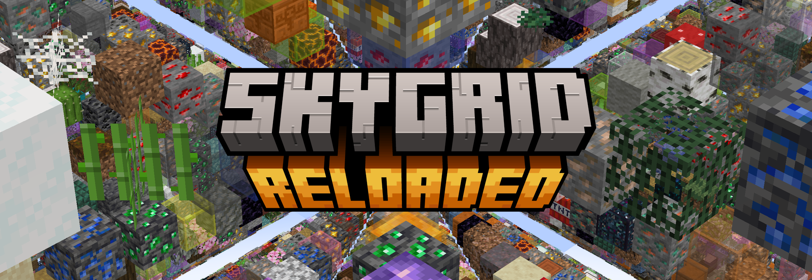

# About the mod

**SkyGrid Reloaded** is a mod that adds SkyGrid as a world preset. It is Inspired by
SethBling's [original survival map](https://www.youtube.com/watch?v=5dhs3ithXDA) and has the following features:

* Customizable block weightings, chest loot and mob spawners with a client side UI.
* Several in-built presets.
* Locally savable custom presets.
* Core of mod is **server side** - clients do not need the mod to connect to servers running SkyGrid worlds.
* Partial support for modded blocks.